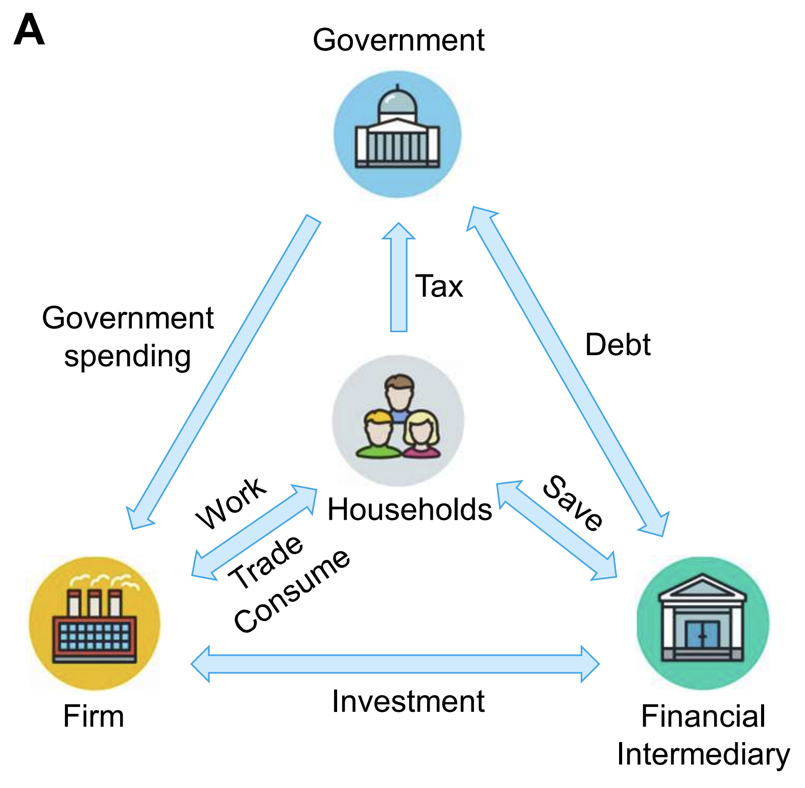
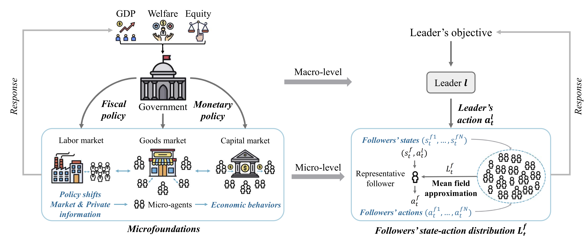
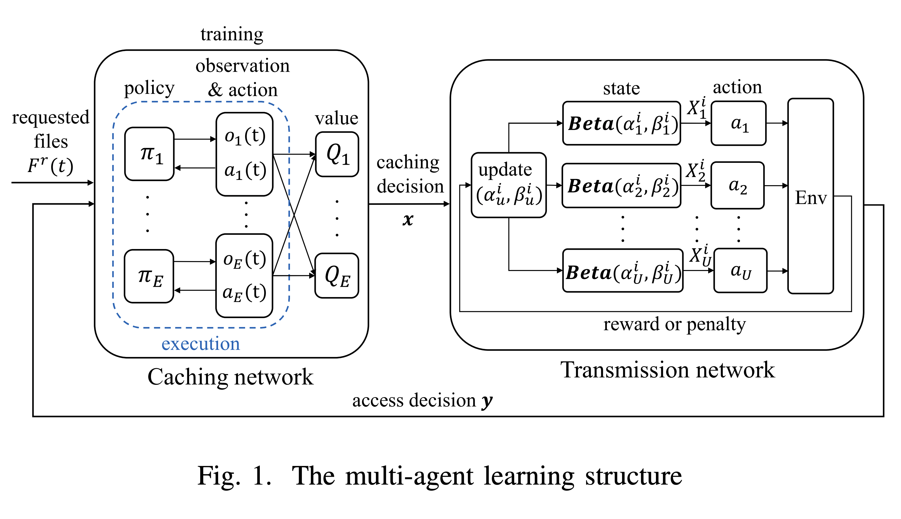
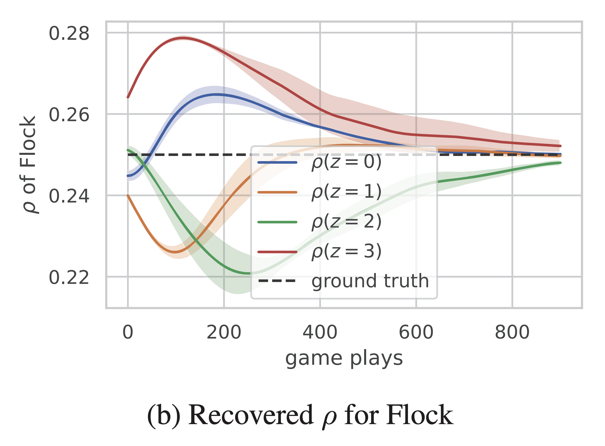
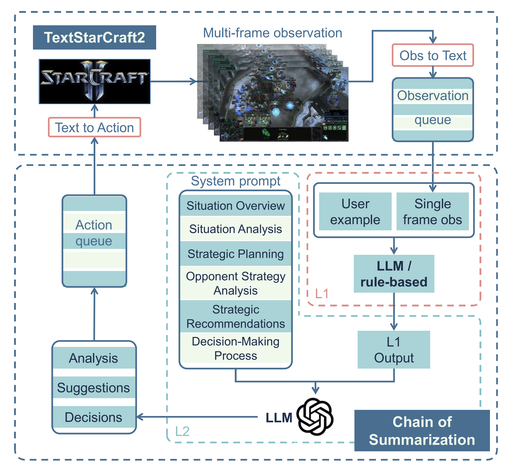








I am a Ph.D. student at the Institute of Automation, Chinese Academy of Sciences (CASIA), working in [the Collective Decision Intelligence Lab](http://marl.ia.ac.cn), under the supervision of [Prof. Jun Wang](http://www0.cs.ucl.ac.uk/staff/Jun.Wang/) and [Prof. Haifeng Zhang](https://pkuzhf.github.io). Currently, I am a Visiting Ph.D. student at Nanyang Technological University (NTU), co-advised by [Prof. Bo An](https://personal.ntu.edu.sg/boan/).

My research interests mainly focus on these aspects: 

- **AI Agents**: Reinforcement Learning (RL) agents, Large Language Model (LLM) agents, Multi-Agent Systems, Population-agent system, Game Theory.

- **AI for Economics**: Agent-based modeling, Economic simulations, and Social simulations.

# 📖 Education

- **Ph.D. in Pattern Recognition and Intelligent Systems, [Institute of Automation, Chinese Academy of Sciences (CASIA)](http://www.ia.cas.cn/)**  
  Aug. 2021 – Present, Beijing, China  
  Supervisor:  [Prof. Jun Wang](http://www0.cs.ucl.ac.uk/staff/Jun.Wang/) and [Prof. Haifeng Zhang](https://pkuzhf.github.io)

- **Visiting Ph.D. in College of Computing and Data Science (CCDS), [Nanyang Technological University (NTU)](https://www.ntu.edu.sg/)**  
  Oct. 2024 – Present, Singapore  
  Supervisor: [Prof. Bo An](https://personal.ntu.edu.sg/boan/)

# 🔥 News

- **2025.3**: Our [AAMAS 2025 Computational Economic Competition](http://jidiai.cn/aamas_tax_2025/) has officially started!
- **2025.3**: Invited to give a talk at the *Dadao Forum (大道论坛)* hosted by Shandong Institute of Business and Technology, titled *"Game-Theoretic Agents for Economic and Social Governance"* [Talk Poster](../images/publications/shandong_talk.png)
- **2025.2**: Our competition proposals were accepted by [AAMAS 2025](https://aamas2025.org/).
- **2024.12**: Attended the [4th Workshop on Network Economics and Game Theory](https://asleepx.github.io/Workshop/).
- **2024.12**: Gave invited talks at Shanghai Jiao Tong University ([JHC Lecture Series](https://mp.weixin.qq.com/s/sHpYNGbdhmb1I_BALd9NXg)) and Fudan University on *"Game-Theoretic Agents for Economic Problems"*.
- **2024.12**: Gave an invited talk at [DAI 2024](https://www.adai.ai/dai/2024/index.html).
- **2024.12**: Our paper was accepted to AAMAS 2025: [*Mean Field Correlated Imitation Learning*](https://arxiv.org/abs/2404.09324).
- **2024.10**: Started a visiting position in Prof. Bo An’s group.
- **2024.9**: Our paper was accepted to NeurIPS 2024: [*Large Language Models Play StarCraft II: Benchmarks and a Chain of Summarization Approach*](https://proceedings.neurips.cc/paper_files/paper/2024/hash/f0ebc318e2df08360b2df559e81602e5-Abstract-Conference.html).
- **2024.5**: Attended [AAMAS 2024](https://www.aamas2024-conference.auckland.ac.nz/) and gave an oral presentation.
- **2023.12**: Our paper was accepted to AAMAS 2024 (Oral): [TaxAI: A Dynamic Economic Simulator and Benchmark for Multi-Agent Reinforcement Learning](https://www.ifaamas.org/Proceedings/aamas2024/pdfs/p1390.pdf)

# 📝 Selected Publications  

  

    

      
AAMAS 2024 (Oral)

      
    

  

  

  
  **TaxAI: A Dynamic Economic Simulator and Benchmark for Multi-Agent Reinforcement Learning, AAMAS 2024 (Oral)**

  **Qirui Mi**, Siyu Xia, Yan Song, Haifeng Zhang, Shenghao Zhu, Jun Wang

  [Paper](https://www.ifaamas.org/Proceedings/aamas2024/pdfs/p1390.pdf), [Github](https://github.com/jidiai/TaxAI)

  

  

    

      
    

  

  

  
  **Learning Macroeconomic Policies based on Microfoundations: A Stackelberg Mean Field Game Approach (under-review)**

  **Qirui Mi**, Zhiyu Zhao, Siyu Xia, Yan Song, Jun Wang, Haifeng Zhang

  [Paper](https://arxiv.org/abs/2403.12093)

  

  

    

      
GLOBECOM 2021

      
    

  

  

  
  **Joint Caching and Transmission in the Mobile Edge Network: A Multi-Agent Learning Approach, GLOBECOM 2021**

  **Qirui Mi**, Ning Yang, Haifeng Zhang, Haijun Zhang, Jun Wang

  [Paper](https://ieeexplore.ieee.org/abstract/document/9685590)

  

  

    

      
AAMAS 2025

      
    

  

  

  
  **Mean Field Correlated Imitation Learning, AAMAS 2025**

  Zhiyu Zhao, **Qirui Mi**, Ning Yang, Xue Yan, Haifeng Zhang, Jun Wang, Yaodong Yang

  [Paper](https://arxiv.org/abs/2404.09324)

  

  

    

      
NeurIPS 2024

      
    

  

  

  
  **Large Language Models Play StarCraft II: Benchmarks and a Chain of Summarization Approach, NeurIPS 2024**

  Weiyu Ma, **Qirui Mi**, Yongcheng Zeng, Xue Yan, Yuqiao Wu, Runji Lin, Haifeng Zhang, Jun Wang

  [Paper](https://proceedings.neurips.cc/paper_files/paper/2024/hash/f0ebc318e2df08360b2df559e81602e5-Abstract-Conference.html)

  

# 🏆 Awards

- 优秀学生干部 · 2024  
- 优秀三好学生 · 2023  
- 北京市普通高等学校优秀毕业生 · 2021  
- 北京市普通高校优秀本科毕业设计 · 2021  
- 美国大学生数学建模竞赛 M 奖 · 2019  
- 第十届“挑战杯”首都大学生课外学术科技作品竞赛二等奖 · 2019  
